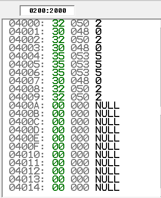
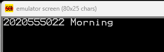

# Project Work which will replace the Final Exam

Write an assembly code which will create similar outputs described and shown below.

1- Store your student number in memory adresses starting from 0100:2000h. Every number(char) will be stored in one byte address. (Hint DB)

2- Move your student number 0100:2000h memory array starting from to 0200:2000h memory address.  (MOVSB)

3- Display your student number and decide education status either 'Morning' or 'Evening' education. Print to the screen. (Hint: CMP, INT)  

Update this README.md file with your own screenshots and explanations. Do not upload new README.md file.   
Update final.asm file with your own code.  
**Do not cheat. Do not copy. Do not share your work with your friends.**

Use git commands to upload your work to your own repository. Do not use file upload option on the web interface of the github.

# CEN214 - Microprocessors Lab. Final Exam solutions
## 1. Step

## 2. Step

## 3. Step

## 4. The Code

    include 'emu8086.inc'          ;At the beginning of the code, an inclusion of the file named "emu8086.inc" is requested.
    .code                          ;Used to specify the code section where the code will run.

    student_Number db '2020555022'
    mov di, offset student_Number      ;The memory address of the "student_Number" variable is assigned to the "di" (destination index) register.

    mov bx, 0                      ;The "bx" (base register) is set to 0, and the "cx" (count register) is set to 10. Then, a procedure named "sendMemory" is called.
    mov cx, 10  
    call sendMemory  
    mov cx, 10                     ;The "cx" register is set to 10, the "bx" register is set to 200h (hexadecimal), and the "es" (extra segment) register is assigned the value of "bx". The "di" register is set to 2000h (hexadecimal). Finally, a procedure named "moveMemory" is called.
    mov bx, 200h
    mov es, bx
    mov di, 2000h
    call moveMemory

    mov al, byte ptr [2006h]       ;The value at address [2006h] is loaded into the "al" (accumulator low) register. Then, the "al" register is compared to '6'. If they are not equal, jump to the "mornings" label; otherwise, jump to the "evening" label.
    cmp al, '6'
    jne mornings
    jmp exit

    mornings:
    mov ah, 0eh
    mov al, ' '
    int 10h
    mov al, 'M'
    int 10h
    mov al, 'o'
    int 10h
    mov al, 'r'
    int 10h
    mov al, 'n'
    int 10h
    mov al, 'i'
    int 10h
    mov al, 'n'
    int 10h
    mov al, 'g'
    int 10h
    jmp exit
     
    exit:
    ret

    sendMemory proc    
    mov al, [di]
    mov [2000h+bx],al  
    mov ah, 0eh
    int 10h
    inc di
    inc bx
    loop sendMemory
    ret
    sendMemory endp
    moveMemory proc
    rep movsb
    ret
    moveMemory endp
    end
